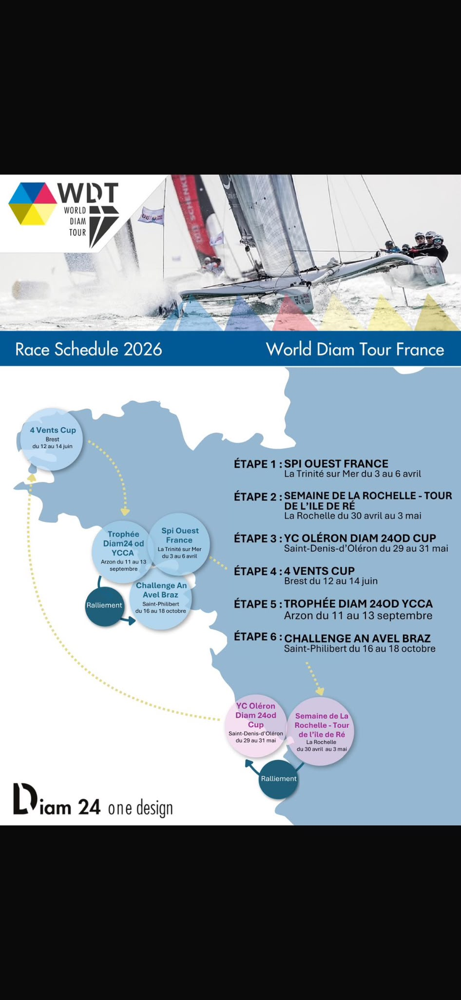

# Référence — calendrier géographique de saison

## Source visuelle

Capture fournie le 18 juillet 2026 et conservée dans le dépôt :

La capture présente le calendrier 2026 du World Diam Tour France sous forme d’infographie : carte de la façade Atlantique, six étapes géolocalisées, ordre chronologique et liaisons de ralliement.

Le calendrier intégré reprend exactement les six étapes fournies : Spi Ouest-France, Semaine de La Rochelle — Tour de l’île de Ré, YC Oléron Diam 24OD Cup, 4 Vents Cup, Trophée Diam 24OD YCCA et Challenge An Avel Braz. Les quatre premières sont terminées ; les étapes d’Arzon et de Saint-Philibert restent à venir.

## Ce qui est utile

- comprendre immédiatement que le championnat est un circuit territorial ;
- relier les dates aux lieux ;
- distinguer les étapes des ralliements ;
- visualiser l’ordre du championnat sans lire un tableau ;
- donner une identité collective à la saison, au-delà d’une seule course.

## Ce qui ne doit pas être repris

- bulles flottantes sans hiérarchie ;
- illustration cartographique approximative ;
- flèches décoratives difficiles à suivre ;
- typographie et densité hétérogènes ;
- mélange entre affiche imprimée et interface interactive ;
- absence d’états sélectionné, passé, en cours et à venir.

## Traduction SailBoard

La version SailBoard utilise :

- la carte satellite comme territoire réel ;
- une liaison chronologique précise entre les étapes ;
- une timeline permanente avec six étapes numérotées ;
- des états passé, sélectionné et à venir ;
- une interaction commune entre la carte, la météo et la timeline ;
- une liaison animée entre les lieux du championnat, sans inventer le parcours d’une course ;
- une timeline compacte conservée sur mobile ;
- le langage visuel existant : noir Atlantique, blanc, jaune acide et typographie compétition.

La timeline est la navigation temporelle commune de SailBoard. Elle sert à lire et parcourir le championnat comme un itinéraire sportif, sur tous les écrans publics.
