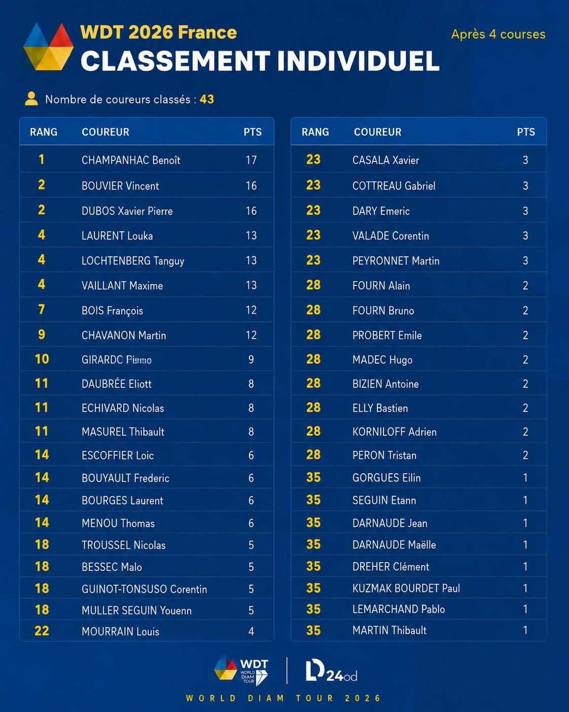

# Référence — classements WDT 2026 France

## Source structurée

Le classeur `Classement WDT 2026.xlsx`, fourni le 18 juillet 2026, est la source de vérité des classements provisoires après quatre étapes.

- `Clasement Team` contient les places de neuf équipes sur les six étapes et leur total ;
- `Classement coureurs` contient les points de 43 coureurs sur les six étapes et leur total ;
- les colonnes des étapes 5 et 6 sont vides car leurs résultats ne sont pas encore publiés ;
- les totaux du classeur sont des sommes simples des valeurs par étape.

Le visuel historique reste conservé à titre de référence graphique :

## Règles intégrées

Deux directions de classement coexistent :

- équipes : les places de chaque étape sont additionnées et le total le plus bas gagne ;
- individuel : les points de chaque étape sont additionnés et le total le plus élevé gagne.

Les égalités utilisent un classement de compétition standard : des totaux égaux partagent le même rang et le rang suivant saute les places déjà occupées (`1, 2, 2, 4`). Aucun départage absent du classeur n’est inventé.

## Corrections apportées grâce au classeur

Le premier visuel annonçait 43 coureurs mais n’affichait que 42 noms. Le classeur identifie la ligne manquante : `CAHIERC Pierre`, avec 10 points (`0 + 5 + 0 + 5`).

L’application ne recopie donc plus les rangs incohérents de l’affiche. Elle recalcule les rangs depuis les totaux structurés, notamment :

- `BOIS François` et `CHAVANON Martin` partagent le rang 7 avec 12 points ;
- `CAHIERC Pierre` est rang 9 avec 10 points ;
- `GIRARDOT Simon` est rang 10 avec 9 points ;
- le groupe à 1 point commence au rang 36.

## Fichiers d’intégration

- `data/wdt-2026-team-standings.json` conserve les résultats par équipe et par étape ;
- `data/wdt-2026-individual-standings.json` conserve les résultats par coureur et par étape ;
- `lib/wdt-2026.ts` vérifie chaque total et calcule les rangs dans le bon sens ;
- les valeurs `null` des étapes à venir restent distinctes d’un score nul.
